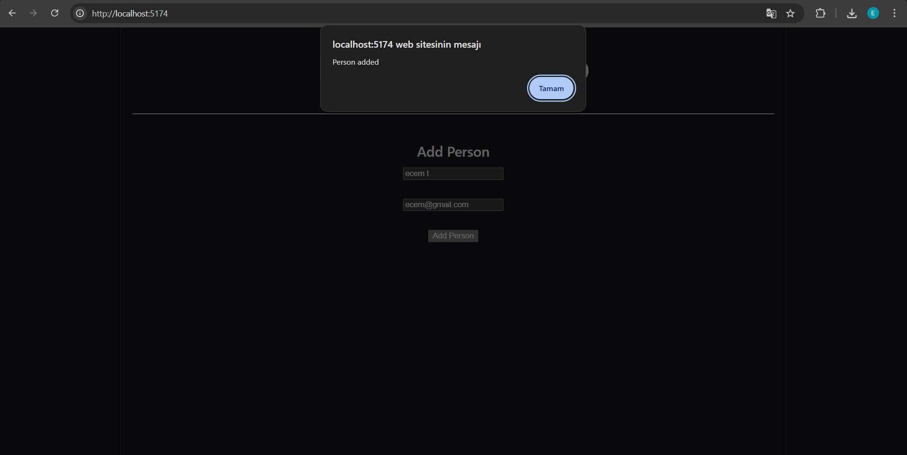
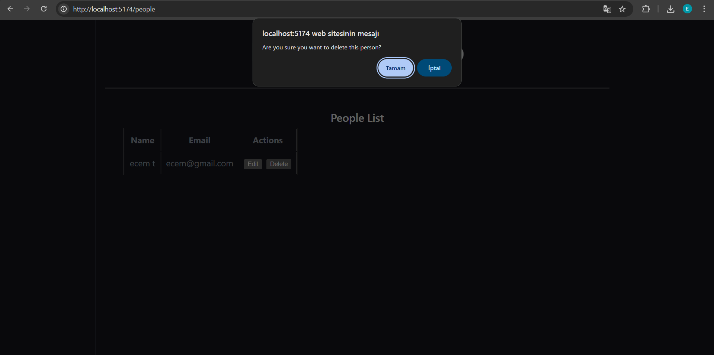
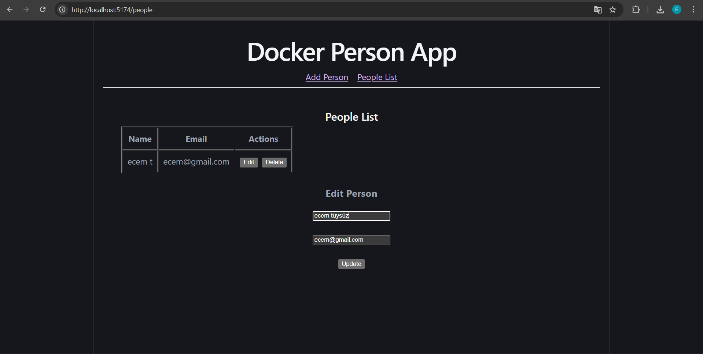
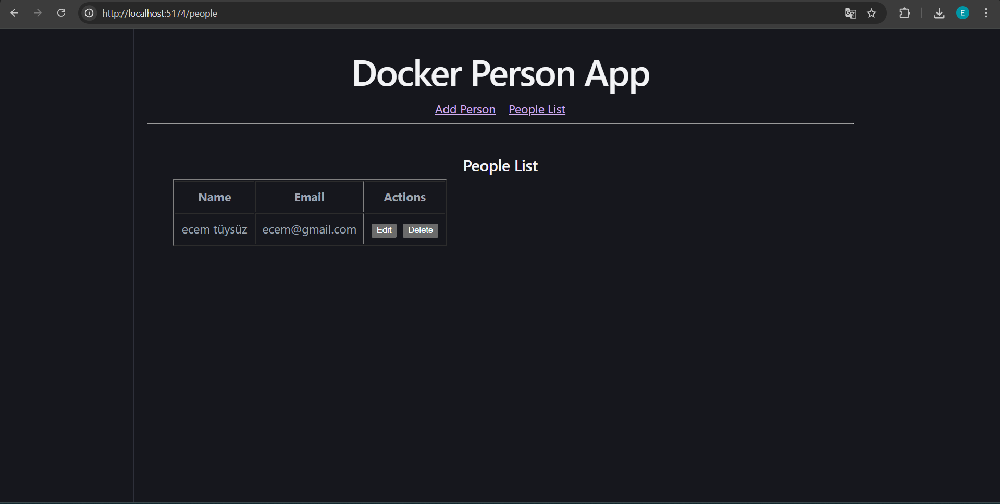
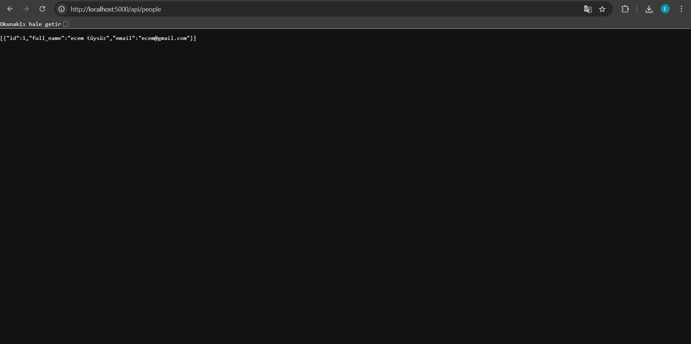

# Docker Person App
This project is a full-stack web application built using Docker.

It allows users to add, view, update and delete people stored in a PostgreSQL database.
## Technologies Used

- Docker
- Docker Compose
- Node.js
- Express.js
- React (Vite)
- PostgreSQL
## How to Run the Project
Clone the repository

```
git clone https://github.com/ecem28/SENG384-individual.git
```

Navigate to the project folder

```
cd SENG384-individual
```

Run Docker

```
docker compose up --build
```
## Application URLs
Frontend

```
http://localhost:5173
```

Backend API

```
http://localhost:5000/api/people
```
## Application Screenshots





## Author

Ecem Tüysüz  
Çankaya University – Software Engineering
